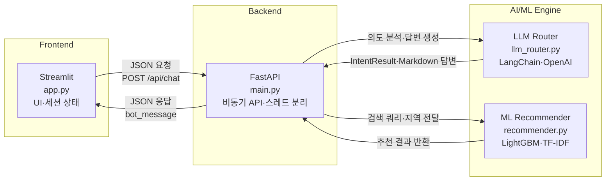
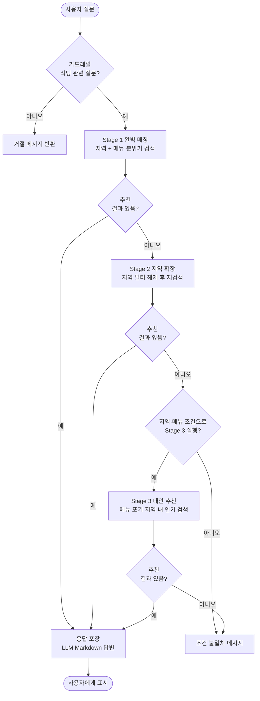

# chatbot

식당 추천 챗봇 — **Streamlit** 프론트엔드, **FastAPI** 백엔드, **LangChain(OpenAI)** 의도·답변 생성, **TF-IDF + LightGBM** 하이브리드 추천으로 구성됩니다.

## 아키텍처 개요

아래 다이어그램은 요청이 UI에서 ML·LLM 엔진까지 흐르는 구조와, 검색 실패 시 단계적으로 조건을 완화하는 **다단계 폴백** 순서를 보여 줍니다.

### 🏛️ 시스템 아키텍처

사용자는 Streamlit에서 대화하고, FastAPI가 비동기로 의도 분석·추천·최종 문장 생성을 조합합니다. 추천 점수는 `recommender.py`에서, 자연어와 가드레일은 `llm_router.py`에서 처리합니다.

### 🔄 지능형 검색 파이프라인

`main.py`의 `_multi_stage_recommend`가 의미 유사도·지역 하드 필터를 적용한 뒤, 단계마다 조건을 완화합니다. 폴백이 발생하면 `fallback_reason`과 식당 리스트를 묶어 LLM이 서두에 양해 문구를 넣은 Markdown 답변을 생성합니다.

> **참고:** Stage 2는 `required_location`이 있을 때만 실행되고, Stage 3는 지역과 `core_menu`가 모두 있을 때 실행됩니다. Stage 3에서는 분위기 키워드가 없으면 기본 쿼리(`맛집 식당 인기`)로 해당 지역 후보를 다시 탐색합니다.
